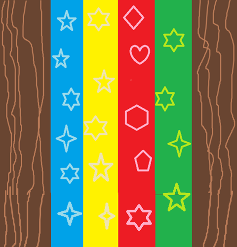

# 🐀🪤 Whack A Mouse
**Whack A Mouse** là trò chơi 2D đơn giản được viết bằng C++ và SDL2. Người chơi sẽ cố gắng ghi được nhiều điểm nhất có thể để ngăn chặn lũ chuột không ăn phô mai...  

## ❇️ Các tính năng
- **🎵 Chọn nhạc nền:**  
  Có 3 nhạc nền thể hiện vibe khác nhau: Retro, Mario và 8Bitgame.
    
- **Số chuột xuất hiện sẽ ngày càng tăng lên:**  
  
Chuột xám với tốc độ di chuyển khá an toàn, dễ dàng lấy điểm nhờ việc đập trúng con chuột này.  
  
Chuột nâu có tốc độ di chuyển nguy hiểm hơn, và ta sẽ lấy được 2 điểm nếu đập trúng.  
  
Chuột cam có tốc độ gây choáng nhất tựa như chỉ xuất hiện thoáng qua nhưng ta sẽ lấy được 3 điểm nếu đập trúng được nó.  
  
Chuột xanh lướt qua nhanh như chuột cam nhưng nếu đập nó thì ta sẽ **⛔GameOver!!**

## 🕹️ Cách chơi
- **Người dùng sử dụng chuột để click vào các ô cột có chuột xuất hiện**  
   
- **Nhấn phím `Esc` hoặc click vào biểu tượng  để tạm dừng**

## 💻 Hướng dẫn chạy & cài đặt game
### Yêu cầu:
- Hệ điều hành: Windows/Linux
- Cài sẵn: `SDL2`, `SDL2_image`, `SDL2_mixer`, `SDL2_ttf`
- Trình biên dịch C++ hỗ trợ C++17 trở lên
### Trên Linux:
`sudo apt install libsdl2-dev libsdl2-image-dev libsdl2-mixer-dev libsdl2-ttf-dev
g++ main.cpp -o WhackAMouse -lSDL2 -lSDL2_image -lSDL2_mixer -lSDL2_ttf
./WhackAMouse`
### Trên Windows:
- Cài đặt SDL2 và các thư viện đi kèm.
- Dùng IDE như Visual Studio, Code::Blocks hoặc MinGW.
- Thêm thư viện .lib và include đúng thư mục SDL2, cấu hình path đầy đủ.
- Build và chạy.

 ## 📁 Cấu trúc thư mục:
 `
 ├── main.cpp                # Entry point `  
 `
├── game.h                 # Điều khiển toàn bộ trò chơi  `  
`
├── graphics.h             # Xử lý vẽ và texture  `  
`
├── Mouse.h                # Các thuộc tính của chuột  `  
`
├── Column.h               # Dùng để kiểm tra vị trí chuột đã click hay chưa  `  
`
├── State.h                # Trạng thái game  `  
`
├── Stat.h                 # Trạng thái điểm  `  
`
├── defs.h                 # Hằng số định nghĩa toàn cục`    
`
├── assets/                #phím`  
## Checklist
- Dùng các lệnh vẽ hình
- Texture
- Background
- Event chuột
- Event bàn phím
- Background
- Animation (hoạt hình)
- Xử lý va chạm
- Score (có tính điểm)
- Lưu bảng điểm
- Sound
- Sound on off
- Background music
- Font
- Menu
- Pause/Resume
- Status bar / lives (mạng/máu...)

